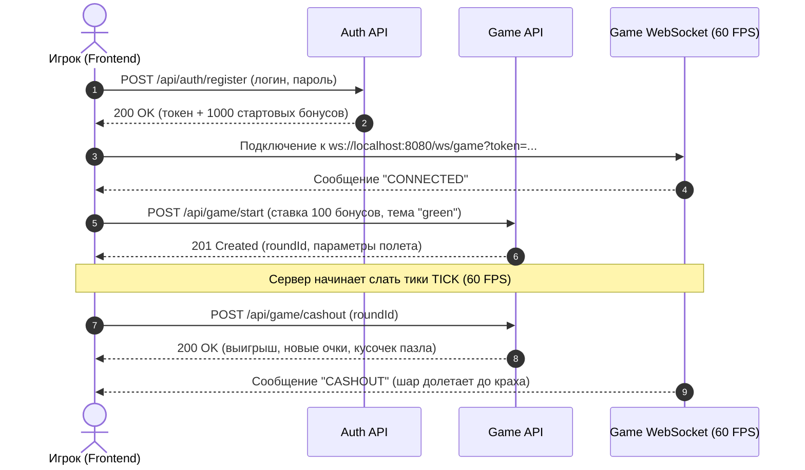

# MOG Backend API — Человекочитаемая документация

> 📍 **Централизованный блок API:** документация систематизирована в виде отдельного модуля в [**`docs/api/`**](../../docs/api/README.md).

Добро пожаловать в документацию бэкенда интерактивной crash-игры **«Воздушный Шар»** (проект *MOG — Make Ochko Great* для хакатона «Столото»).

Этот раздел написан простым, понятным языком специально для **фронтенд-разработчиков, мобильных разработчиков, тестировщиков и интеграторов**. Здесь нет сухого бюрократического кода — каждый эндпоинт снабжен объяснением *зачем он нужен*, *как он связан с интерфейсом*, *какие данные отправлять* и *что ожидать в ответ*.

---

## 🧭 Навигация по разделам документации

Документация разбита на тематические модули, чтобы вам не приходилось листать один огромный файл:

1. 👤 [**01. Аутентификация и пользователи**](./01-auth-and-users.md)  
   Регистрация, вход, JWT-токены, получение профиля, смена пароля и быстрое пополнение баланса для тестов (Top-Up).
2. 🎈 [**02. Игровой цикл (Game Loop)**](./02-game-flow.md)  
   Полный путь раунда: выбор темы и бустера, старт полета, проверка статуса, фиксация выигрыша (Cashout), крах шара и история игр.
3. ⚡ [**03. WebSocket в реальном времени (60 FPS)**](./03-websocket-stream.md)  
   Стриминг тиков полета шара с частотой 60 кадров/сек, всплески бустеров, пуши кэшаута и краха, ping/pong и стратегия реконнекта.
4. 🧩 [**04. Мета-игра и удержание игроков**](./04-meta-game.md)  
   Коллекция из 9 пазлов с защитой от неудач (Pity Timer и Bad Luck Protection), 6 динамических рангов по прибыли, 10 достижений и шестиугольник характеристик (Radar Stats в стиле Dota 2).
5. 🏆 [**05. Турниры, Лидерборд и SSE-стримы**](./05-tournament-and-sse.md)  
   Суточные соревнования до 23:59:59 МСК, динамические призы для ТОП-3, 1 Гц Server-Sent Events стримы турнирной таблицы и финализация.
6. ⚙️ [**06. Админка, House Edge и Provably Fair**](./06-admin-and-provably-fair.md)  
   Горячее обновление конфига игры (Hot-Reload), математика адаптивного House Edge и клиентская проверка честности через HMAC-SHA256.
7. 📋 [**07. Шпаргалка TypeScript и справочник ошибок**](./07-cheatsheet-and-contracts.md)  
   Готовые TypeScript-интерфейсы, единый формат ответов об ошибках (`ErrorResponse`), шпаргалка HTTP-кодов и чек-лист для интеграции.

---

## 🏗 Ключевые архитектурные принципы

Перед началом интеграции полезно знать 3 фундаментальных правила бэкенда:

1. **Сервер — единственный источник правды (Server-Authoritative)**  
   Клиент **не решает**, лопнул ли шар, сработал ли бустер и сколько начислено денег. Сервер рассчитывает траекторию и исход до старта раунда. Клиент лишь визуализирует получаемые данные. Любые попытки сжульничать или прислать поддельный выигрыш отклоняются сервером.
2. **Нулевые задержки и высокая плавность (Java 21 Loom)**  
   Бэкенд работает на легковесных виртуальных потоках (Project Loom) под управлением Quarkus 3.x. Тики множителя шара транслируются в WebSocket с частотой ~16 мс (60 FPS), обеспечивая идеальную плавность анимации.
3. **Два типа стриминга данных:**
   - **WebSocket (`/ws/game`)**: персональный игровой канал для каждого игрока (тики множителя, события бустера, мгновенный кэшаут);
   - **Server-Sent Events (`/api/tournament/.../stream`)**: легковесный широковещательный канал (1 Гц) для турнирной таблицы и лидерборда, чтобы фронтенду не нужно было делать постоянный опрос (polling).

---

## 🌐 Базовые адреса и сетевые протоколы

| Протокол | Назначение | Базовый URL |
|---|---|---|
| **HTTP REST** | Основные CRUD-операции, старт игры, кэшаут, конфиг | `http://localhost:8080` |
| **WebSocket** | Игровой стрим тиков полета шара (60 FPS) | `ws://localhost:8080/ws/game?token=<jwt>` |
| **SSE** | Стрим турнирной таблицы и рейтинга лидеров (1 Гц) | `http://localhost:8080/api/tournament/stream` |
| **Swagger UI** | Интерактивная веб-консоль для ручных тестов API | `http://localhost:8080/q/swagger-ui` |

---

## 🔑 Как работает авторизация (JWT Bearer)

1. **Для REST API:**  
   После успешного входа (`/api/auth/login`) или регистрации (`/api/auth/register`) клиент получает строку токена `token`.  
   В каждый последующий защищенный запрос передавайте HTTP-заголовок:
   ```http
   Authorization: Bearer <ваш_токен>
   ```
2. **Для WebSocket:**  
   Поскольку браузерный JavaScript `new WebSocket(url)` не позволяет передавать произвольные заголовки, токен передается в query-параметре URL:
   ```javascript
   const socket = new WebSocket(`ws://localhost:8080/ws/game?token=${token}`);
   ```
3. **Срок жизни:** Токен действует **24 часа** (86 400 секунд).
4. **Тестовые учетные записи (сидируются автоматически):**
   - **Администратор:** логин `admin` (или `admin@stoloto.ru`), пароль `admin123` (роль `ADMIN`, баланс 50 000 бонусов);
   - **Игроки турнира:** `alex_pilot`, `sky_queen`, `wind_master` и другие.

---

## 🚨 Единый формат ошибок бэкенда

Если что-то пошло не так (например, не хватает средств на ставку или не передан токен), бэкенд возвращает статус `4xx` или `5xx` со стандартизированным телом ответа:

```json
{
  "status": 400,
  "error": "Bad Request",
  "message": "Недостаточно бонусов на балансе для совершения ставки",
  "timestamp": "2026-09-12T12:00:00.000Z"
}
```

Фронтенд может напрямую отображать текст из поля `message` во всплывающем уведомлении (Toast / Alert).

---

## 🚀 Быстрый старт: путь игрока от регистрации до полета за 4 шага



Переходите к первому разделу: [**01. Аутентификация и пользователи**](./01-auth-and-users.md) 🚀
