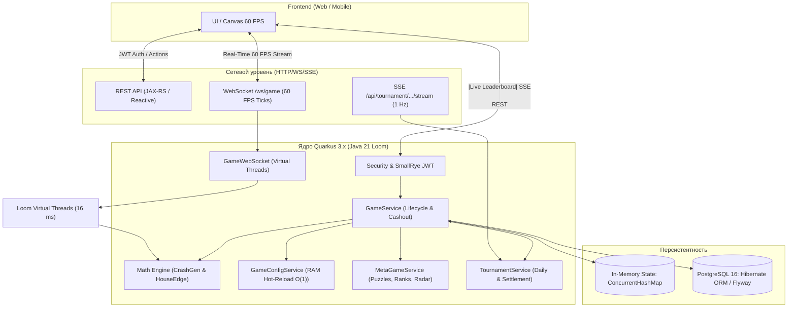

# 🚀 Backend: Игровой сервер «Воздушный Шар» (MOG)

> **Проект:** «Воздушный Шар: Бонусная crash-игра с турнирной механикой»  
> **Хакатон:** Чемпионат России по «Продуктовому программированию» (Министерство спорта РФ, ФСП, Столото)  
> **Стек:** Java 21 LTS · Quarkus 3.x · Virtual Threads (Loom) · WebSockets Next · PostgreSQL 16 · Flyway · SmallRye JWT  
> **Архитектура:** Server-Authoritative · Event-Driven 60 FPS · Provably Fair (HMAC-SHA256) · Hot-Reload в RAM  

---

## 📑 Содержание
1. [Архитектурный обзор и стек технологий](#-1-архитектурный-обзор-и-стек-технологий)
2. [Почему Quarkus 3.x: Обоснование выбора и производительность](#-2-почему-quarkus-3x-обоснование-выбора-и-производительность)
3. [Системные требования](#-3-системные-требования)
4. [Быстрый запуск (Quick Start)](#-4-быстрый-запуск-quick-start)
5. [Режимы работы и команды сборки](#-5-режимы-работы-и-команды-сборки)
6. [Конфигурация и переменные окружения](#-6-конфигурация-и-переменные-окружения)
7. [База данных и миграции Flyway](#-7-база-данных-и-миграции-flyway)
8. [Инструменты мониторинга и отладки](#-8-инструменты-мониторинга-и-отладки)
9. [Связанная документация проекта](#-9-связанная-документация-проекта)

---

## 🛠 1. Архитектурный обзор и стек технологий

Серверная часть спроектирована по принципу **строгого серверного авторитета (Server-Authoritative)**: клиентское приложение отвечает только за рендеринг и сбор действий пользователя, в то время как расчет случайности, физика полета, срабатывание бустеров, валидация кэшаута и транзакции баланса выполняются на сервере.



### Ключевые компоненты стека:
* **Язык разработки:** **Java 21 LTS** — с активным использованием Project Loom (`Virtual Threads`), `Record` классов для неизменяемых DTO/исходов и усовершенствованного сопоставления с образцом (`Pattern Matching`).
* **Фреймворк:** **Quarkus 3.x (Supersonic Subatomic Java)** — cloud-native фреймворк с оптимизацией времени сборки (Build-Time Initialization).
* **Real-time транспорт:** **Quarkus WebSockets Next** — современный высокопроизводительный реактивный WebSocket-движок для непрерывного стриминга координат шара.
* **Server-Sent Events (SSE):** **RESTEasy Reactive Multi** — легковесная push-рассылка турнирной таблицы (1 Гц) без накладных расходов двустороннего сокета.
* **ORM и доступ к данным:** **Hibernate ORM with Panache** — лаконичный Active Record / Repository pattern поверх высокопроизводительного пула соединений Agroal.
* **Миграции БД:** **Flyway** — версионирование схемы БД и автоматический накат изменений при старте.
* **Безопасность:** **SmallRye JWT / MicroProfile JWT** — stateless авторизация на базе асимметричных ключей (RSA-256) и поддержка RBAC (`USER`, `ADMIN`).
* **База данных:** **PostgreSQL 16** — реляционное хранилище с индексами по очкам/времени и поддержкой JSONB для горячих конфигураций игры.

---

## ⚡ 2. Почему Quarkus 3.x: Обоснование выбора и производительность

Выбор **Quarkus 3.x** вместо традиционного Spring Boot был обусловлен жесткими нефункциональными требованиями ТЗ Столото к производительности crash-игры (60 FPS стриминг, нулевые задержки при кэшауте, моментальный старт и экономия серверных ресурсов).

### 🚀 Ключевые преимущества Quarkus в архитектуре MOG:

#### 1. Симбиоз с Java 21 Project Loom (Virtual Threads)
В отличие от классических серверов (Tomcat / Jetty), где каждый поток привязан к потоку ядра ОС (1–2 МБ стека на поток), Quarkus нативно интегрирован с виртуальными потоками Java 21:
* В нашей реализации стриминг тиков каждого активного полета запускается на виртуальном потоке:
  ```java
  Thread.ofVirtual().name("ws-flight-" + userId).start(() -> { ... });
  ```
* Каждый виртуальный поток весит всего **несколько сотен байт** и переключается в пространстве пользователя без syscall-оверхеда ядра.
* Сервер способен параллельно вести **десятки тысяч одновременных 60 FPS полетов** шаров на стандартном 4-ядерном сервере без троттлинга и деградации Latency.

#### 2. Минимальный footprint оперативной памяти (RSS)
* В режиме JVM Quarkus потребляет всего **~45–65 МБ RSS**, тогда как аналогичный сервис на Spring Boot требует от 350 до 550 МБ.
* Это позволяет запускать бэкенд в ультракомпактных контейнерах с низким лимитом памяти и значительно сокращает стоимость инфраструктуры при масштабировании.

#### 3. Build-Time оптимизация (никакого Reflection Overhead в Runtime)
* Quarkus производит внедрение зависимостей (ArC DI), анализ аннотаций JAX-RS/Jackson и построение метамодели Hibernate **на этапе сборки (build-time)**.
* В рантайме полностью отсутствует динамическая генерация прокси и тяжелая рефлексия. В результате:
  - Холодный старт сервера в JVM занимает **менее 1.5 секунды**;
  - Первые запросы пользователей обрабатываются без «прогрева» JIT-компилятора.

#### 4. Высокопроизводительный Hot-Reload конфигураций $O(1)$ в RAM
По ТЗ §1.9 администратор должен менять коэффициенты игры, очки и вероятности лута на лету. В Quarkus это реализовано через `AtomicReference<GameConfigDto>`:
* Во время 60 FPS тиков чтение параметров происходит напрямую из RAM за **$< 0.05$ микросекунды** без обращений к БД;
* При вызове админского `PUT /api/admin/config` ссылка атомарно подменяется, а изменения сохраняются в JSONB PostgreSQL в фоновом режиме.

---

## 📋 3. Системные требования

* **Java Development Kit (JDK):** OpenJDK 21 LTS или новее (протестировано на OpenJDK 21 Temurin и Java 26 Temurin).
* **Сборщик:** Maven 3.9+ (в репозиторий включен исполняемый wrapper `./mvnw`).
* **Docker & Docker Compose:** для запуска локальной СУБД PostgreSQL или полного контейнерного стека.
* **Операционная система:** macOS, Linux, Windows (WSL2).

---

## 🏁 4. Быстрый запуск (Quick Start)

Запуск бэкенда с нуля занимает **менее 2 минут**.

### Шаг 1. Клонирование и запуск PostgreSQL
Из корневой директории репозитория поднимите контейнер базы данных:
```bash
# Из корня проекта
docker compose up -d postgres
```
*База данных поднимется на порту `5432` (`mog_db`, пользователь: `mog_user`, пароль: `mog_pass`).*

---

### Шаг 2. Запуск бэкенда в режиме разработки (Dev Mode)
Перейдите в папку `backend` и запустите Maven wrapper:
```bash
cd backend
./mvnw quarkus:dev
```

> **Преимущества Quarkus Dev Mode:**
> - **Live Reload:** Любые правки в Java-коде, DTO или SQL-миграциях вступают в силу мгновенно при следующем запросе без перезапуска приложения!
> - **Встроенная консоль:** Нажмите `h` для справки, `d` для перехода в Dev UI, `q` для выхода.

---

### Шаг 3. Проверка готовности сервера
После старта приложение слушает порт `8080`:
```bash
curl -i http://localhost:8080/q/health
```
Ожидаемый ответ: `{"status": "UP", "checks": [...]}`.

---

## 🔨 5. Режимы работы и команды сборки

Все команды выполняются из директории `backend/`:

### 1. Компиляция и синтаксическая проверка
```bash
./mvnw clean compile
```

### 2. Запуск юнит- и интеграционных тестов
```bash
./mvnw test
```
*Запуск конкретного теста математической модели:*
```bash
./mvnw test -Dtest=CrashGeneratorTest,HouseEdgeCalculatorTest
```

### 3. Production сборка (Fast-JAR)
```bash
./mvnw clean package -DskipTests
```
Артефакты сборки формируются в директории `target/quarkus-app/`:
* `quarkus-run.jar` — главный исполняемый файл приложения;
* `lib/` и `app/` — разделенные библиотеки и оптимизированный байткод проекта.

### 4. Запуск собранного Production JAR
```bash
java -jar target/quarkus-app/quarkus-run.jar
```

### 5. Сборка и запуск в Docker
Полный запуск приложения и базы данных через Docker Compose:
```bash
# Из корня репозитория:
docker compose up --build backend postgres
```

Сборка легковесного standalone Docker-образа бэкенда:
```bash
# Из папки backend:
./mvnw package -DskipTests
docker build -f src/main/docker/Dockerfile.jvm -t mog-backend:latest .
docker run -i --rm -p 8080:8080 mog-backend:latest
```

---

## ⚙️ 6. Конфигурация и переменные окружения

Все параметры системы задаются в [`src/main/resources/application.properties`](file:///Users/kenny/Work/hack2026_mog/backend/src/main/resources/application.properties) и могут быть переопределены через системные переменные окружения (Environment Variables):

| Переменная окружения | Назначение | Дефолт (Local Dev) | Production рекомендация |
|---|---|:---:|---|
| `QUARKUS_HTTP_PORT` | Порт HTTP, WebSocket и SSE | `8080` | `8080` |
| `QUARKUS_DATASOURCE_JDBC_URL` | JDBC-строка подключения к PostgreSQL | `jdbc:postgresql://localhost:5432/mog_db` | `jdbc:postgresql://postgres:5432/mog_db` |
| `QUARKUS_DATASOURCE_USERNAME` | Пользователь БД | `mog_user` | Секрет из Vault/K8s |
| `QUARKUS_DATASOURCE_PASSWORD` | Пароль пользователя БД | `mog_pass` | Секрет из Vault/K8s |
| `JWT_SECRET` | 256-битный секрет генерации JWT | `dev-jwt-secret-key-must-be-at-least-256-bits-long!` | Надежная криптографическая строка |
| `GAME_DEV_SEED` | Сид для тестирования детерминированного исхода | *(пусто — CSPRNG)* | Оставлять пустым для честной игры |

### Пример запуска с кастомными переменными:
```bash
QUARKUS_HTTP_PORT=8085 QUARKUS_DATASOURCE_JDBC_URL=jdbc:postgresql://prod-db:5432/mog_db java -jar target/quarkus-app/quarkus-run.jar
```

---

## 🗄 7. База данных и миграции Flyway

Управление структурой базы данных полностью автоматизировано через **Flyway**:
- Миграции расположены в каталоге: [`src/main/resources/db/migration/`](file:///Users/kenny/Work/hack2026_mog/backend/src/main/resources/db/migration/);
- Формат наименования: `V<Номер_версии>__<Описание>.sql`;
- При каждом старте Quarkus автоматически сверяет контрольные суммы и накатывает свежие миграции без необходимости ручного вмешательства.

### Прямой доступ к PostgreSQL в контейнере:
```bash
docker exec -it mog-postgres psql -U mog_user -d mog_db
```

#### Полезные команды в консоли psql:
```sql
\dt                  -- список таблиц (users, game_rounds, game_configs, etc.)
SELECT * FROM game_configs; -- просмотр активного JSONB конфига игры
SELECT id, username, bonus_balance, current_house_edge FROM users;
```

---

## 🔍 8. Инструменты мониторинга и отладки

После запуска сервера разработчикам и жюри доступны встроенные консоли Quarkus:

| Сервис | URL | Назначение |
|---|---|---|
| **Swagger UI** | [http://localhost:8080/q/swagger-ui](http://localhost:8080/q/swagger-ui) | Интерактивная консоль тестирования REST эндпоинтов |
| **OpenAPI Schema** | [http://localhost:8080/q/openapi](http://localhost:8080/q/openapi) | Машиночитаемая спецификация OpenAPI 3.0 (JSON/YAML) |
| **Quarkus Dev UI** | [http://localhost:8080/q/dev-ui](http://localhost:8080/q/dev-ui) | Дашборд управления бинами, конфигурацией и расширениями |
| **Liveness Probe** | [http://localhost:8080/q/health/live](http://localhost:8080/q/health/live) | Проверка работоспособности процесса JVM |
| **Readiness Probe** | [http://localhost:8080/q/health/ready](http://localhost:8080/q/health/ready) | Проверка доступности подключений к PostgreSQL |
| **WebSocket Stream** | `ws://localhost:8080/ws/game?token=<jwt>` | Персональный стрим 60 FPS тиков полета шара |

---

## 📚 9. Связанная документация проекта

Подробные спецификации всех систем вынесены в специализированные разделы документации:

* 🧮 **[Математические модели и игровая логика (`docs/math/`)](../docs/math/README.md):**
  - [**01. Математика, доказательство RTP 96% и Provably Fair**](../docs/math/01-math-models.md) — вывод формул, дифференциальные уравнения House Edge, скрипты верификации.
  - [**02. Игровая логика, темы и бустеры**](../docs/math/02-game-logic.md) — 9 и 12 уровней, алгоритм бустеров, скоринг и мета-игра.
  - [**Скрипт Monte Carlo симуляции (Python)**](../docs/math/scripts/simulate_rtp.py) — эмуляция 1 000 000 раундов.
* 🔌 **[API & Контракты взаимодействия (`docs/api/`)](../docs/api/README.md):**
  - [01. Аутентификация и пользователи](../docs/api/01-auth-and-users.md)
  - [02. Игровой цикл](../docs/api/02-game-flow.md)
  - [03. WebSocket 60 FPS](../docs/api/03-websocket-stream.md)
  - [04. Мета-игра и удержание](../docs/api/04-meta-game.md)
  - [05. Турниры и SSE](../docs/api/05-tournament-and-sse.md)
  - [06. Админка и честность](../docs/api/06-admin-and-provably-fair.md)
  - [07. Шпаргалка и типы](../docs/api/07-cheatsheet-and-contracts.md)
* 📋 [**Исходное ТЗ хакатона Столото (`CASE.md`)**](../CASE.md)
