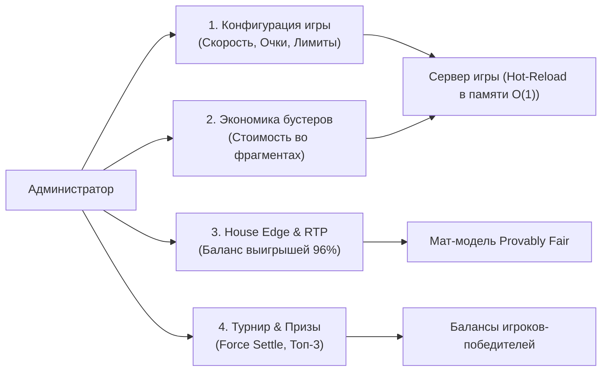

# 🛠️ Руководство по панели администратора MOG («Воздушный Шар»)

Добро пожаловать в руководство администратора и игрового оператора проекта **«Воздушный Шар» (MOG)**. 
Здесь простыми словами объяснено, как зайти в панель управления, за что отвечает каждый переключатель, как на лету менять правила игры и как вручную управлять турнирами.

---

## 🚀 1. Быстрый старт: как войти в админку

Панель управления находится прямо в веб-интерфейсе игры по адресу:
👉 **`http://localhost:5173/admin`** (или `/admin` на вашем домене).

### Как получить доступ:
1. Перейдите на страницу входа `/`.
2. **Способ 1 (В один клик):** Нажмите кнопку **«Войти как Admin»** внизу экрана.
3. **Способ 2 (Вручную):**
   * **Логин:** `admin`
   * **Пароль:** `admin123`
4. После входа система определит вашу роль как `ADMIN` и автоматически перенаправит вас в панель управления.

> [!NOTE]
> **Безопасность:** Обычные игроки не имеют доступа к админке. При попытке неавторизованного запроса сервер возвращает ошибку `403 Forbidden`.

---

## 🧭 2. Обзор интерфейса: 4 главных блока

Панель разделена на четыре логические зоны:
1. **Конфигурация раундов (Hot-Reload)** — живая настройка физики полета, множителей, очков и наград без перезапуска сервера.
2. **Экономика бустеров и фрагментов** — управление тарифами бустеров во фрагментах пазла (`[0, 2, 4, 6]`).
3. **House Edge и RTP** — контроль честности, процента возврата игрокам и преимущества казино.
4. **Турнир и выплата наград** — ручное подведение итогов турнира, начисление призов победителям и архив соревнований.



---

## ⚙️ 3. Блок 1: Параметры игры — что за что отвечает

Все параметры из этого блока обновляются **на лету (Hot-Reload)**. Вам не нужно перезагружать сервер или выгонять игроков из сессий.

### 📊 Таблица параметров понятным языком

| Параметр в админке | По умолчанию | Простыми словами: что это? | На что влияет в игре? |
|---|:---:|---|---|
| **Alpha (крутизна распределения краха)** | `1.30` | **«Характер аварий шара»**. Определяет математический закон распределения случайных точек падения. | **Чем выше Alpha:** шар чаще лопается на небольших и средних множителях, игра стабильнее для казино.<br/>**Чем ниже Alpha:** шар чаще совершает ультра-высокие полеты ($20\times \dots 100\times$). |
| **Максимальный множитель** | `100.0` | **«Потолок полета»**. Максимальный коэффициент, выше которого шар подняться не может физически. | Защита от бесконечного полета. На этом множителе раунд автоматически завершается победой. |
| **Минимальный множитель краха** | `1.01` | **«Мгновенный крах»**. Самый ранний коэффициент, на котором шар может лопнуть сразу после старта. | По правилам ТЗ шар не может лопнуть ниже этого значения (например, ровно на $1.00\times$). |
| **Темп роста множителя (growthRate)** | `0.22` | **«Спидометр полета»**. Как быстро тикают цифры множителя на экране в секунду. | **0.22** — комфортный темп (раунд до $2\times$ длится $\approx 3.5$ сек).<br/>Если поставить **0.40** — шар полетит как ракета.<br/>Если поставить **0.10** — полет будет плавным и медленным. |
| **Ускорение роста (1 = ровно, 2 = резко)** | `1.5` | **«Турбо-наддув на высоте»**. Степень разгона шара по мере набора высоты. | На низких высотах шар летит спокойно, но чем выше забирается — тем быстрее мелькают цифры, подогревая нервы игрока. |
| **Очки за уровень (points_per_line)** | `10` | **«Награда за высоту»**. Сколько очков турнира дается за каждую пройденную белую высотную линию. | Игрок получает эти очки **всегда**, даже если шар потом лопнул! Это мотивирует играть дальше. |
| **Очки за cashout** | `25` | **«Премия за спасение»**. Дополнительные турнирные очки, если игрок успел нажать кнопку «Забрать». | Награда за хладнокровие и успешную фиксацию прибыли. |
| **Очки за бустер** | `50` | **«Супер-бонус бустера»**. Очки, начисляемые игроку в момент пролета через отметку бустера. | Дополнительный стимул выбирать бустер перед стартом. |
| **Порог выигрыша для апсейла** | `50` | **«Что считать крупной победой»**. Минимальный чистый выигрыш в бонусах для показа поздравительного экрана. | При выигрыше от 50 бонусов вылетает праздничный экран с конфетти и предложением купить лотерейный билет «Столото». |
| **Таймаут попапа, с** | `10` | **«Время поздравления»**. Сколько секунд висит праздничный экран победы. | По истечении этого времени игра сама возвращает пользователя в режим готовности к новой ставке. |

---

### 🚀 Множители бустеров и управление стоимостью в пазлах

В панели управления ([AdminPage.tsx](file:///Users/kenny/Work/hack2026_mog/frontend/src/features/admin/AdminPage.tsx)) оператор может независимо настраивать две ключевые шкалы для каждого из 4 уровней бустеров (Tier 1 – Tier 4):

1. **Множители бустеров (`boosterTierValues`):**
   - **Tier 1:** По умолчанию `1.0×` (базовый полет).
   - **Tier 2:** По умолчанию `2.0×` (удвоение текущего множителя).
   - **Tier 3:** По умолчанию `3.0×` (утроение текущего множителя).
   - **Tier 4:** По умолчанию `4.0×` (увеличение текущего множителя в 4 раза).

2. **Стоимость бустеров в пазлах (`boosterCostFragments`):**
   - **Tier 1:** По умолчанию `0` фрагментов (бесплатно).
   - **Tier 2:** По умолчанию `2` фрагмента.
   - **Tier 3:** По умолчанию `4` фрагмента.
   - **Tier 4:** По умолчанию `6` фрагментов.

#### Как это работает для игрока:
* Стартовый запас каждого игрока — **6 фрагментов**, максимальный предел — **10 фрагментов**.
* При старте раунда (`POST /api/game/start`) с выбранным бустером сервер проверяет наличие фрагментов. Если у игрока их недостаточно, запуск блокируется (`400 Bad Request`).
* Потраченные фрагменты восполняются победами и встроенным Pity Timer (+20% к вероятности дропа за каждый раунд без кусочка пазла).
* Если оператор хочет сделать игру максимально доступной (например, для промо-акций), он может снизить стоимость, например до `[0, 1, 2, 3]`, и нажать **«Сохранить»**. Настройки применятся со следующего раунда мгновенно!

> [!TIP]
> **Как работает бустер в полете:**  
> Если шар летит на множителе $1.80\times$ и пересекает отметку бустера Tier 2 ($2.0\times$), множитель мгновенно подскакивает до $3.60\times$, экран взрывается золотыми искрами, а игроку начисляются бонусные очки!

---

### 🕹️ Кнопки управления в панели администратора:

В нижней части формы доступны действия:
1. **«Сохранить»** (синяя кнопка) — выполняет строгую проверку типов и диапазонов через Zod-схему, отправляет запрос на сервер (`PUT /api/admin/config`), сохраняет данные в PostgreSQL и обновляет оперативную память сервера. Показывает уведомление: *«Параметры сохранены — применятся со следующего раунда»*.
2. **«Сбросить»** (кнопка с рамкой) — отменяет все несохраненные правки в полях формы и возвращает те значения, которые сейчас фактически работают на сервере.
3. **«Выйти»** (кнопка в правом верхнем углу) — мгновенный возврат на экран игры `/`.

> [!NOTE]
> **Сброс к заводским дефолтам ТЗ:**  
> Если параметры были случайно искажены и необходимо вернуть эталонные константы хакатона, администратор может отправить запрос `POST /api/admin/config/reset` (например, через Swagger UI по адресу `/q/swagger-ui`).

---

### 🧰 Вспомогательные функции оператора на игровом экране:

Для удобства демонстрации работы жюри и быстрого тестирования на экране игры реализованы специальные инструменты:

1. **Быстрое пополнение баланса («+ Добавить 1000»):**
   - Находится в плашке баланса ([BalanceCard.tsx](file:///Users/kenny/Work/hack2026_mog/frontend/src/features/bet/BalanceCard.tsx)).
   - При нажатии мгновенно начисляет **+1 000 бонусов** на текущий аккаунт через эндпоинт `POST /api/top-up` (также доступны алиасы `/api/game/top-up` и `/api/users/me/top-up`) без необходимости создавать новых пользователей.
2. **Автовывод на 2.00x («Автовывод x2»):**
   - Кнопка-тумблер в панели действий ([ActionBar.tsx](file:///Users/kenny/Work/hack2026_mog/frontend/src/features/bet/ActionBar.tsx)).
   - При активации подсвечивается золотым индикатором `Автовывод x2 ✓`.
   - Клиентский контроллер полета ([use-round-controller.ts](file:///Users/kenny/Work/hack2026_mog/frontend/src/features/flight/use-round-controller.ts)) автоматически фиксирует выигрыш ровно при достижении множителя $\ge 2.00\times$, исключая сетевую задержку реакции человека.

---

## 🎲 4. Блок 2: House Edge и RTP (Баланс казино)

Crash-игра — это игра с математически выверенной вероятностью. Сервер предоставляет эндпоинты для контроля и демонстрации честности:

* **Текущий House Edge (Комиссия казино):** По умолчанию **4.00%**. Это математическое преимущество платформы на длинной дистанции.
* **Теоретический возврат (RTP — Return to Player):** **96.00%**. Это означает, что из каждых 100 условных бонусов ставок игрокам в среднем возвращается 96 бонусов в виде призов.
* **Матожидание игрока (EV):** **-4.00%**.

### 🧠 Адаптивная динамическая балансировка:
Сервер MOG оснащен «умной защитой»:
* Если игроку не везет и он проигрывает несколько раз подряд — система плавно **снижает House Edge** (вплоть до 0.5%), увеличивая шансы шара улететь выше, чтобы поддержать интерес игрока.
* Если игрок забирает крупные выигрыши подряд — House Edge мягко возвращается к стандарту.

### Эндпоинты контроля баланса казино:
* `GET /api/game/house-edge` — возвращает текущее значение House Edge, расчетный RTP и математическое ожидание игрока.
* `POST /api/game/house-edge/reset` — сбрасывает историю адаптации текущей сессии и возвращает House Edge ровно к 4.00%. Полезно при демонстрации работы алгоритма жюри.

---

## 🏆 5. Блок 3: Турниры и выплата наград (Force Settle)

В игре действует суточный турнир. Игроки набирают очки за полеты и соревнуются в лидерборде в реальном времени.

### Призовой фонд топ-3:
* 🥇 **1 место:** 100% от набранных очков победителя в виде бонусов на баланс
* 🥈 **2 место:** 60% от набранных очков в виде бонусов на баланс
* 🥉 **3 место:** 30% от набранных очков в виде бонусов на баланс

### Досрочная финализация турнира (`POST /api/tournament/settle?force=true`):
В штатном режиме турнир закрывается автоматически раз в сутки в полночь планировщиком задач (`00:00:00 MSK`).  
Однако **на презентации или при тестировании** ждать полночи не нужно:

**Вызов `POST /api/tournament/settle?force=true` делает следующее:**
1. Моментально подводит итоги текущего турнира.
2. Начисляет реальные призовые бонусы на балансы игроков из Топ-3.
3. Отправляет игрокам в реальном времени обновление через 1 Гц SSE стрим (`/api/tournament/stream`).
4. Добавляет запись в архив прошедших турниров (`GET /api/tournament/history`).
5. Очищает турнирную таблицу и начинает новый турнирный день с нуля.

---

## 🔮 6. Что такое Hot-Reload и почему полет не прерывается?

В отличие от старых систем, где изменение настроек требовало перезагрузки Java-сервиса (`restart service`), в MOG применен принцип **снапшотов раунда (Snapshot Isolation)**:

```
[Админ меняет скорость с 0.22 на 0.40 и жмет Сохранить]
                       │
       ┌───────────────┴───────────────┐
       ▼                               ▼
[Шар Игрока А уже летит]       [Игрок Б начинает раунд]
- Долетает спокойно            - Летит уже по новой скорости
- Скорость 0.22 (снапшот)      - Скорость 0.40 (новая настройка)
- Никаких дерганий и вылетов   - Мгновенный эффект!
```

* **Безопасность:** Игрок никогда не потеряет ставку из-за того, что админ сохранил настройки в середине его полета.
* **Производительность:** Сервер хранит конфиг в переменной `AtomicReference` в оперативной памяти. WebSocket читает параметры со скоростью наносекунд — процессор не нагружается запросами в базу данных.

---

## 🎯 7. Рекомендованные пресеты для демонстрации

Если вы показываете игру жюри или тестируете разные сценарии, вот 3 готовых набора параметров:

### 1. «Динамичный экшен» (Идеально для 3-минутного демо)
* **`growthRate`:** `0.35` (шар взлетает быстро и зрелищно)
* **`growthAcceleration`:** `1.8` (высокий накал страстей)
* **`pointsBoosterBonus`:** `100` (щедрые очки)
* **Результат:** Быстрые раунды, море эмоций, частая смена лидеров на турнирном табло.

### 2. «Марафон высоких множителей» (Для любителей риска)
* **`alpha`:** `1.15` (повышенный шанс гигантских множителей $30\times \dots 80\times$)
* **`maxMultiplier`:** `100.0`
* **`growthRate`:** `0.18` (размеренный полет)
* **Результат:** Напряженное ожидание и возможность сорвать огромный куш.

### 3. «Стандарт Столото» (Базовый баланс ТЗ)
* Просто нажмите красную кнопку **«Заводские настройки (Reset)»** — система восстановит математически выверенные значения по умолчанию из ТЗ §1.9.

---

## ❓ 8. Частые вопросы и решение проблем

#### В: Я изменил параметры, но у игрока на экране старая скорость?
**О:** Игрок сейчас находится в полете. Параметры обновятся ровно в момент старта следующего раунда.

#### В: Выдает ошибку «Проверьте корректность значений» при сохранении.
**О:** Сработала валидация безопасности. Убедитесь, что:
* `minCrashMultiplier` не меньше `1.0`;
* `growthAcceleration` лежит в диапазоне от `1.0` до `3.0`;
* Все числовые поля заполнены и не отрицательны.

#### В: Как сбросить очки тестовых пользователей в турнире?
**О:** Нажмите кнопку **«Финализировать турнир (Force Settle)»** — топ-3 получат призы, а текущая таблица очков очистится.

---

*Документ подготовлен командой разработки MOG. По техническим вопросам работы API обратитесь к разделу [docs/api/06-admin-and-provably-fair.md](./api/06-admin-and-provably-fair.md).*
