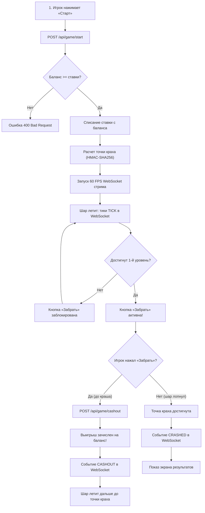

# 02. Игровой цикл (Game Flow)

В этом разделе детально описан жизненный цикл раунда в crash-игре **«Воздушный Шар»**: от момента, когда игрок выбирает ставку, до взлета, сбора бустеров, фиксации выигрыша или краха шара.

---

## 🎮 Концепция и механика игры

«Воздушный Шар» — это быстрая азартная crash-игра:
1. Игрок выбирает размер ставки, тему полета (зеленая или красная) и, по желанию, множитель бустера ($\times 2, \times 3, \times 4$).
2. После нажатия кнопки **«Старт»** шар начинает подниматься ввысь, а текущий коэффициент выигрыша плавно растет по экспоненциальной формуле:
   $$M(t) = 1.00 \cdot e^{0.06 \cdot t}$$
3. По пути шар пересекает высотные уровни. На одном из уровней может висеть выбранный игроком **Бустер**, который при пересечении мгновенно умножает текущий коэффициент!
4. **Задача игрока** — нажать кнопку **«Забрать» (Cashout)** до того, как шар лопнет (краш).
5. Если игрок успевает забрать — он получает выигрыш `ставка × множитель`, турнирные очки и шанс выбить фрагмент пазла.
6. Если шар лопается раньше — ставка сгорает, но накопленные за пройденные высотные уровни очки турнира всё равно сохраняются за игроком!

---

## 🗺 Схема жизненного цикла раунда



---

## 1. Подготовка и получение тарифов бустеров

### `GET /api/game/boosters`
Публичный эндпоинт без авторизации. Возвращает актуальную сетку стоимости бустеров во фрагментах пазла, настроенную администратором.

- **Авторизация:** Не требуется
- **Запрос:** `GET /api/game/boosters`

#### Пример успешного ответа `200 OK`:
```json
[
  { "tier": 1, "multiplier": 1.0, "costFragments": 0 },
  { "tier": 2, "multiplier": 2.0, "costFragments": 2 },
  { "tier": 3, "multiplier": 3.0, "costFragments": 4 },
  { "tier": 4, "multiplier": 4.0, "costFragments": 6 }
]
```

Фронтенд использует эти тарифы для отображения стоимости на кнопках выбора бустера (`BoosterPicker`) и проверки возможности выбора бустера на основе текущего `fragmentBalance` пользователя (из `GET /api/users/me`).

---

## 2. Запуск раунда (Взлет)

### `POST /api/game/start`
Инициализирует новый раунд, проверяет баланс бонусов и фрагментов, списывает ставку и стоимость бустера, и начинает полет.

- **Авторизация:** `Authorization: Bearer <token>`
- **Заголовки:** `Content-Type: application/json`

#### Тело запроса (JSON)
```json
{
  "betAmount": 100,
  "theme": "green",
  "boosterMultiplier": 3
}
```

#### Описание полей запроса:
| Поле | Тип | Обязательное | Дефолт | Описание |
|---|---|:---:|:---:|---|
| `betAmount` | number | Нет | `100` | Сумма ставки в бонусах (минимум `1`). Также поддерживается фронтенд-алиас `cost`. |
| `theme` | string | Нет | `"green"` | Тема игры: `"green"` (зеленая, 9 уровней) или `"red"` (красная, 12 уровней). |
| `boosterMultiplier` | number | Нет | `1` | Множитель бустера: `1` (без бустера, 0 фрагментов), `2` ($\times 2$), `3` ($\times 3$), `4` ($\times 4$). Поддерживается алиас `boosterTier` (1..4). |

#### Что происходит на сервере:
1. Если у игрока уже есть незавершенный активный раунд, сервер автоматически завершает его крашем.
2. **Проверка баланса бонусов:** проверяется условие `bonusBalance >= betAmount`. При нехватке возвращается ошибка `400 Bad Request`.
3. **Проверка баланса фрагментов (Booster Economy):** если выбран бустер (`boosterMultiplier > 1`), бэкенд проверяет стоимость во фрагментах (`boosterCostFragments`). Если `fragmentBalance < cost`, возвращается ошибка `400 Bad Request` (ставка бонусов при этом не списывается).
4. Сумма ставки списывается с бонусного баланса, а стоимость бустера — с `fragmentBalance` игрока (расходуется окончательно, не возвращается при краше).
5. Сервер рассчитывает детерминированную точку краха с использованием криптографического HMAC-SHA256 (Provably Fair) и House Edge игрока.
6. Если выбран бустер (`boosterMultiplier > 1`), сервер случайно и честно назначает уровень его появления (от 2 до `totalLevels - 2`).
7. В базу данных сохраняется раунд со статусом `IN_PROGRESS`.
8. В виртуальном потоке запускается 60 FPS стрим тиков в открытый WebSocket игрока.

#### Ошибки при валидации (`400 Bad Request`):
- **Нехватка фрагментов:**
```json
{
  "error": "Недостаточно фрагментов для активации бустера x3: требуется 4, доступно 1"
}
```
- **Нехватка бонусного баланса:**
```json
{
  "error": "Недостаточно средств на балансе"
}
```

#### Успешный ответ `201 Created` (`GameRoundStartResult`)
```json
{
  "roundId": "3fa85f64-5717-4562-b3fc-2c963f66afa6",
  "startTime": "2026-09-12T10:15:00.000Z",
  "initialMultiplier": 1.00,
  "growthRate": 0.06,
  "provablyFairHash": "e3b0c44298fc1c149afbf4c8996fb92427ae41e4649b934ca495991b7852b855",
  "betAmount": 100,
  "boosterMultiplier": 3,
  "boosterLevel": 5,
  "totalLevels": 9,
  "unlockCashoutMultiplier": 1.20,
  "remainingBalance": 900
}
```

#### Значение полей ответа для фронтенда:
- `roundId` (UUID) — уникальный идентификатор раунда. **Обязательно сохраните его на клиенте** — он потребуется для вызова кэшаута (`/api/game/cashout`).
- `provablyFairHash` (string) — хэш исхода до старта игры. Доказывает игроку, что сервер не подменил исход на лету.
- `growthRate` (number) — коэффициент $k = 0.06$. Используется для плавного расчета кривой полета.
- `boosterLevel` (number | null) — номер высотной линии, на которой фронтенд должен нарисовать иконку бустера (например, `5`). Если бустер не выбран — `null`.
- `unlockCashoutMultiplier` (number) — порог разблокировки кнопки вывода:
  - Для зеленой темы: **1.20x** (1-й уровень);
  - Для красной темы: **1.15x** (1-й уровень).
  *До достижения этого множителя кнопка «Забрать» в интерфейсе должна быть неактивной (Disabled).*
- `remainingBalance` (number) — обновленный баланс игрока сразу после списания ставки.

---

## 3. Полет шара и отслеживание множителя

Во время полета множитель непрерывно увеличивается. Клиент получает обновления двумя путями:

### Основной путь: WebSocket стрим (60 FPS)
Сразу после успешного вызова `/api/game/start` в WebSocket-соединение игрока начинают поступать тики:
```json
{
  "type": "TICK",
  "roundId": "3fa85f64-5717-4562-b3fc-2c963f66afa6",
  "multiplier": 1.54,
  "elapsedMs": 7200
}
```
Фронтенд плавно перемещает шар по экрану и обновляет цифру множителя.  
*(Детальное описание всех событий сокета смотрите в [03. WebSocket в реальном времени](./03-websocket-stream.md)).*

### Резервный путь: Опрос состояния раунда (`GET /api/game/state`)
Если интернет-соединение моргнуло, WebSocket разорвался или пользователь обновил страницу прямо во время полета — вызовите этот эндпоинт для восстановления состояния:

- **Запрос:** `GET /api/game/state?roundId=3fa85f64-...` (параметр `roundId` опционален, если не передан — сервер найдет текущий раунд сам).
- **Авторизация:** `Authorization: Bearer <token>`
- **Ответ `200 OK` (`GameRoundStateResult`):**
```json
{
  "roundId": "3fa85f64-5717-4562-b3fc-2c963f66afa6",
  "status": "IN_PROGRESS",
  "isCrashed": false,
  "currentMultiplier": 2.14,
  "crashMultiplier": null,
  "elapsedMs": 12700,
  "potentialWin": 214,
  "startTime": "2026-09-12T10:15:00.000Z",
  "levelsPassed": 3,
  "pointsEarned": 30,
  "boosterActivated": false
}
```
*Примечание: поле `crashMultiplier` возвращается как `null` до тех пор, пока раунд не завершится, чтобы исключить подглядывание.*

---

## 4. Фиксация выигрыша (Cashout)

### `POST /api/game/cashout`
Игрок нажимает кнопку «Забрать» (или срабатывает функция «Автовывод x2»). Сервер по текущей серверной метке времени фиксирует множитель и начисляет выигрыш.

- **Авторизация:** `Authorization: Bearer <token>`
- **Заголовки:** `Content-Type: application/json`

#### Тело запроса:
```json
{
  "roundId": "3fa85f64-5717-4562-b3fc-2c963f66afa6"
}
```

#### Правила проверки сервером:
1. **Разблокировка:** Если текущий множитель меньше `unlockCashoutMultiplier`, сервер вернет ошибку `400 Bad Request` («Вывод доступен только после прохождения 1-го уровня»).
2. **Проверка краха:** Сервер проверяет точное серверное время запроса. Если шар к этой миллисекунде уже лопнул — раунд завершается как `CRASHED` (опоздание).
3. **Учет бустера:** Если шар до нажатия кэшаута успел долететь до уровня бустера, зафиксированный множитель автоматически умножается на `boosterMultiplier`!
4. **Расчет выигрыша:**
   $$\text{winAmount} = \text{round}(\text{betAmount} \times \text{multiplier})$$
5. **Начисление очков:**
   - 10 очков за каждый пройденный высотный уровень;
   - `boosterMultiplier × 10` очков за активацию бустера;
   - **+50 бонусных очков** за успешный кэшаут!
6. **Мета-награды:** Сервер проверяет выпадение кусочка пазла по Pity Timer (если `fragmentBalance < 10`) и открывает разблокированные достижения.

#### Клиентская автоматизация: «Автовывод x2»
На панели управления игрок может включить переключатель **«Автовывод x2»** (`ActionBar.tsx`).
- При активном автовыводе фронтенд в реальном времени отслеживает тики полета (`handleTick`).
- Как только множитель достигает значения $\ge 2.00\times$ (и пройден 1-й уровень разблокировки), клиент автоматически отправляет запрос `POST /api/game/cashout`.
- Это снижает влияние человеческой задержки реакции (пинг, реакция игрока) при игре по популярной стратегии удвоения.

---

### Вариант 1: Успешный выигрыш (`isWin: true`)
Ответ `200 OK`:
```json
{
  "roundId": "3fa85f64-5717-4562-b3fc-2c963f66afa6",
  "status": "FINISHED",
  "isWin": true,
  "multiplier": 3.60,
  "crashMultiplier": 4.82,
  "winAmount": 360,
  "newBalance": 1260,
  "pointsEarned": 90,
  "levelsPassed": 4,
  "boosterActivated": true,
  "boosterMultiplier": 1,
  "nextHouseEdge": 0.0425,
  "serverSeed": "a1b2c3d4e5f6...",
  "clientSeed": "8f3a9e2b1c4d...",
  "nonce": 1726099200000,
  "reward": {
    "kind": "puzzle-piece",
    "pieceId": "piece_3",
    "label": "Фрагмент 3",
    "collected": 7,
    "total": 10
  },
  "unlockedAchievements": [
    {
      "id": "lucky_start",
      "title": "Удачный старт",
      "description": "Выиграть свой первый раунд",
      "letter": "У",
      "unlockedAt": 1726099200000
    }
  ]
}
```

> **Важный нюанс по ТЗ и CASE.md:**  
> После успешного нажатия кнопки «Забрать» шар **не исчезает мгновенно**! Он продолжает визуально лететь дальше вплоть до точки своего краха (`crashMultiplier`). Это позволяет игроку увидеть, сколько он мог бы выиграть, если бы рискнул подождать дольше.

---

### Вариант 2: Игрок опоздал (Шар лопнул)
Если сетевой запрос на кэшаут пришел в момент, когда шар уже лопнул, сервер вернет ответ `200 OK` с поражением:
```json
{
  "roundId": "3fa85f64-5717-4562-b3fc-2c963f66afa6",
  "status": "CRASHED",
  "isWin": false,
  "multiplier": 0.0,
  "crashMultiplier": 1.85,
  "winAmount": 0,
  "newBalance": 900,
  "pointsEarned": 10,
  "levelsPassed": 1,
  "boosterActivated": false,
  "boosterMultiplier": 1,
  "nextHouseEdge": 0.0300,
  "serverSeed": "a1b2c3d4e5f6...",
  "clientSeed": "8f3a9e2b1c4d...",
  "nonce": 1726099200000,
  "reward": null,
  "unlockedAchievements": []
}
```
*Обратите внимание:* Поле `pointsEarned: 10` — даже при сгорании ставки игрок получил 10 турнирных очков за 1-й пройденный уровень!

---

## 5. История завершенных раундов

### `GET /api/game/history`
Возвращает список завершенных игр для отображения в ленте последних ставок или в профиле.

- **Параметры query:**
  - `my` (boolean, по умолчанию `false`):
    - `false` — возвращает **глобальную ленту** раундов всех игроков сервиса (требование CASE.md для экрана ставок, токен не требуется);
    - `true` — возвращает историю только **текущего авторизованного игрока** (требуется Bearer-токен).
  - `limit` (int, от 1 до 100, по умолчанию `20`).

#### Пример ответа `200 OK`:
```json
[
  {
    "roundId": "3fa85f64-5717-4562-b3fc-2c963f66afa6",
    "userId": 42,
    "username": "sky_pilot_99",
    "theme": "green",
    "betAmount": 100,
    "crashMultiplier": 4.82,
    "cashoutMultiplier": 3.60,
    "winAmount": 360,
    "isWin": true,
    "status": "FINISHED",
    "createdAt": "2026-09-12T10:15:00Z"
  },
  {
    "roundId": "8ba12c44-1234-4562-b3fc-9876543210ab",
    "userId": 7,
    "username": "alex_pilot",
    "theme": "red",
    "betAmount": 250,
    "crashMultiplier": 1.42,
    "cashoutMultiplier": null,
    "winAmount": 0,
    "isWin": false,
    "status": "CRASHED",
    "createdAt": "2026-09-12T10:14:20Z"
  }
]
```

---

Переходите к следующему разделу: [**03. WebSocket в реальном времени (60 FPS)**](./03-websocket-stream.md) ⚡
