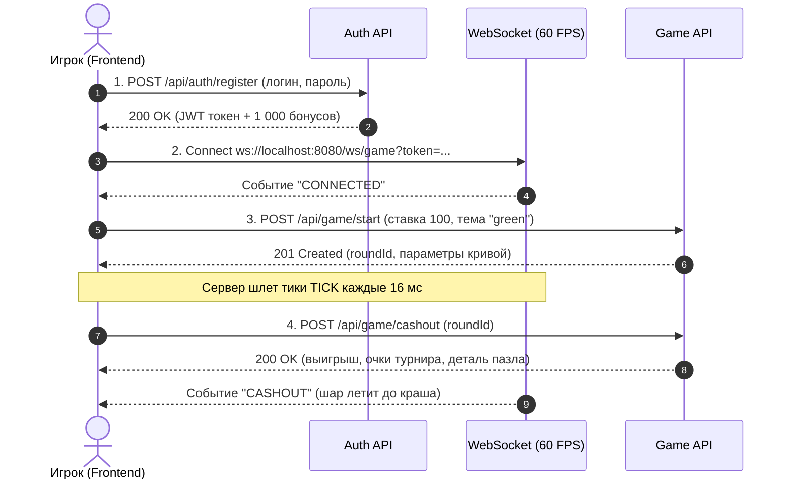

# 🔌 MOG API & Contracts Hub (Входная точка документации)

> **Статус:** Актуален · Версия: 1.4.0 · Quarkus 3.x / Java 21 Loom  
> **Базовый REST URL:** `http://localhost:8080`  
> **Базовый WebSocket URL:** `ws://localhost:8080`  
> **Swagger UI (Интерактивная консоль):** [`http://localhost:8080/q/swagger-ui`](http://localhost:8080/q/swagger-ui)  
> **OpenAPI 3.0 Schema:** [`http://localhost:8080/q/openapi`](http://localhost:8080/q/openapi)

Добро пожаловать в единую входную точку спецификации API и WebSocket-контрактов игры **«Воздушный Шар» (Make Ochko Great)**.

Данный блок спроектирован так, чтобы любой разработчик (Frontend, Mobile, QA, Integrator) мог за 5 минут понять устройство системы, найти нужный эндпоинт и получить готовые TypeScript-типы и примеры запросов.

---

## 🗺 Каталог модулей API

Вся спецификация разбита на 7 логических модулей с подробным человекочитаемым описанием:

```
docs/api/
├── README.md                     # 📍 Вы здесь: общая входная точка, архитектура, быстрый старт
├── 01-auth-and-users.md          # 👤 Регистрация, вход, профиль, смена пароля, Top-Up баланса
├── 02-game-flow.md               # 🎈 Игровой цикл: старт полета, кэшаут, крах, история раундов
├── 03-websocket-stream.md        # ⚡ 60 FPS стрим тиков, всплеск бустера, кэшаут и крах в сокете
├── 04-meta-game.md               # 🧩 Мета-игра: 9 пазлов (Pity Timer), 6 рангов, 10 ачивок, радар 6 осей
├── 05-tournament-and-sse.md      # 🏆 Суточный турнир до 23:59:59 МСК, призы ТОП-3, 1 Гц SSE стрим
├── 06-admin-and-provably-fair.md # ⚙️ Hot-Reload конфига в RAM, проверка HMAC-SHA256, House Edge
└── 07-cheatsheet-and-contracts.md# 📋 Готовые TypeScript интерфейсы, единый формат ошибок, матрица API
```

---

## 🚀 Быстрый старт: запуск первой игры за 4 шага



---

## 🏛 3 главных архитектурных правила

1. **Серверный авторитет (Server-Authoritative):**  
   Исход раунда, точка краха, срабатывание бустера и начисление бонусов рассчитываются исключительно сервером. Фронтенд — визуализатор состояния.
2. **Аутентификация через JWT Bearer:**  
   - Для HTTP: заголовок `Authorization: Bearer <token>`;
   - Для WebSocket: query-параметр `?token=<token>`.  
   Срок действия токена — **24 часа**.
3. **Разделение каналов данных:**
   - **REST API:** транзакционные операции (старт раунда, кэшаут, профиль, настройки);
   - **WebSocket (`/ws/game`):** персональный стрим полета шара (60 кадров/сек);
   - **Server-Sent Events (`/api/tournament/.../stream`):** широковещательный стрим турнирной таблицы и рейтинга (1 Гц) без поллинга.

---

## 🚨 Единый формат ошибок (`ErrorResponse`)

Все ошибки REST API возвращаются в унифицированном формате:

```json
{
  "status": 400,
  "error": "Bad Request",
  "message": "Вывод доступен только после прохождения 1-го уровня (коэффициент не ниже 1.2x)",
  "timestamp": "2026-09-12T12:00:00.000Z"
}
```

Текст из поля `message` можно выводить напрямую в Toast / Alert интерфейса.

---

## 📚 Ссылки на подробные спецификации

1. 👤 [**01. Аутентификация и пользователи**](./01-auth-and-users.md)
2. 🎈 [**02. Игровой цикл (Game Flow)**](./02-game-flow.md)
3. ⚡ [**03. WebSocket в реальном времени (60 FPS)**](./03-websocket-stream.md)
4. 🧩 [**04. Мета-игра и удержание игроков**](./04-meta-game.md)
5. 🏆 [**05. Турниры, Лидерборд и SSE-стримы**](./05-tournament-and-sse.md)
6. ⚙️ [**06. Админка, House Edge и Provably Fair**](./06-admin-and-provably-fair.md)
7. 📋 [**07. Шпаргалка TypeScript и справочник ошибок**](./07-cheatsheet-and-contracts.md)
8. 🧮 [**Математические модели и игровая логика (`docs/math`)**](../math/README.md)

