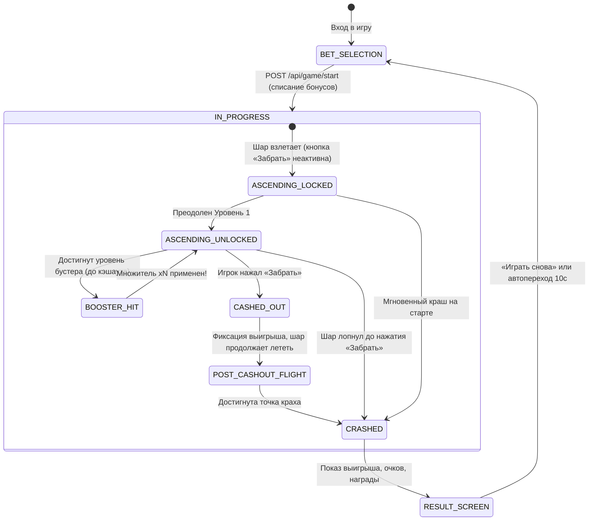

# 02. Игровая логика, механика полета, уровни и бустеры

> **Статус документа:** Актуален · Версия: 1.4.0  
> **Целевая аудитория:** Разработчики клиентской и серверной логики, тестировщики, геймдизайнеры, жюри Столото.  
> **Связанные исходные файлы:**  
> - [`GameLevelConfig.java`](file:///Users/kenny/Work/hack2026_mog/backend/src/main/java/com/hack2026/mog/services/GameLevelConfig.java) — таблицы уровней и расчет очков  
> - [`GameService.java`](file:///Users/kenny/Work/hack2026_mog/backend/src/main/java/com/hack2026/mog/services/GameService.java) — жизненный цикл раунда и авторитетные проверки  
> - [`GameWebSocket.java`](file:///Users/kenny/Work/hack2026_mog/backend/src/main/java/com/hack2026/mog/websocket/GameWebSocket.java) — 60 FPS полет и стриминг событий  

В данном документе детально специфицирована вся прикладная игровая механика crash-игры **«Воздушный Шар»**: выбор ставок и тем, высотные уровни, условия разблокировки кнопки вывода, правила активации бустеров, сохранение полета после кэшаута, начисление очков и краткая сводка мета-систем (пазлы, радар характеристик, турниры, апсейл).

---

## 📑 Содержание
1. [Жизненный цикл раунда (Game Loop & State Machine)](#-1-жизненный-цикл-раунда-game-loop--state-machine)
2. [Темы оформления и высотные уровни](#-2-темы-оформления-и-высотные-уровни)
   - 2.1. [Зеленая тема (9 уровней)](#21-зеленая-тема-9-уровней)
   - 2.2. [Красная тема (12 уровней)](#22-красная-тема-12-уровней)
   - 2.3. [Цветовая дифференциация множителя на UI](#23-цветовая-дифференциация-множителя-на-ui)
3. [Механика выбора ставок и применения бустеров](#-3-механика-выбора-ставок-и-применения-бустеров)
   - 3.1. [Экономика бустеров и расходование фрагментов](#31-экономика-бустеров-и-расходование-фрагментов)
   - 3.2. [Детерминированное размещение бустера](#32-детерминированное-размещение-бустера)
   - 3.3. [Правила активации бустера в полете](#33-правила-активации-бустера-в-полете)
   - 3.4. [Полет шара после Cashout до физического краха](#34-полет-шара-после-cashout-до-физического-краха)
4. [Система начисления турнирных очков (Scoring)](#-4-система-начисления-турнирных-очков-scoring)
5. [Краткое резюме мета-систем и удержания](#-5-краткое-резюме-мета-систем-и-удержания)
   - 5.1. [Коллекция из 10 пазлов и Pity Timer](#51-коллекция-из-10-пазлов-и-pity-timer)
   - 5.2. [6 динамических рангов игрока](#52-6-динамических-рангов-игрока)
   - 5.3. [Полигон характеристик игрока (6 осей радара)](#53-полигон-характеристик-игрока-6-осей-радара)
   - 5.4. [Суточный турнир и живой лидерборд](#54-суточный-турнир-и-живой-лидерборд)
   - 5.5. [Всплывающее окно апсейла лотерей («Закрепи успех»)](#55-всплывающее-окно-апсейла-лотерей-закрепи-успех)

---

## 🔄 1. Жизненный цикл раунда (Game Loop & State Machine)

Вся игра построена на строгой модели **Server-Authoritative**: клиент визуализирует состояние, в то время как сервер валидирует каждый шаг по временным меткам.

### Ключевые этапы раунда:
1. **Выбор темы и ставки:** Игрок выбирает цветовую тему («Зеленый шар» или «Красный шар») и один из доступных фрагментов ставки с бустером.
2. **Инициализация раунда (`POST /api/game/start`):**
   - Проверяется баланс игрока: $bonusBalance \ge betAmount$;
   - Ставка атомарно списывается;
   - Генерируется точка краха через HMAC-SHA256 и персональный House Edge игрока;
   - Запускается 60 FPS WebSocket-стрим тиков.
3. **Полет и блокировка вывода:**
   - До пересечения 1-го высотного уровня кнопка «Забрать» видна, но некликабельна.
   - Как только текущий множитель $M(t) \ge unlockMultiplier$, кнопка становится активной.
4. **Фиксация выигрыша (Cashout):**
   - При клике на «Забрать» (`POST /api/game/cashout`) сервер сверяет серверный timestamp.
   - Начисляется выигрыш: $Win = \text{round}(betAmount \cdot multiplier)$.
   - Сумма выигрыша гарантированно фиксируется и зачисляется на баланс игрока.
5. **Продолжение полета:** Шар продолжает подъем до сгенерированной точки краха, позволяя игроку увидеть, сколько он мог бы выиграть.
6. **Крах и результаты:** После физического взрыва шара открывается модальное окно результатов с начисленными турнирными очками и деталью пазла.

---

## 🎨 2. Темы оформления и высотные уровни

В игре реализованы две темы с разным количеством высотных линий и профилем динамики:

| Параметр | Зеленая тема (`green`) | Красная тема (`red`) |
|---|:---:|:---:|
| **Название** | «Зеленый шар» | «Красный шар» |
| **Количество уровней** | **9 уровней** | **12 уровней** |
| **Порог разблокировки вывода** | **$1.20\times$** (Уровень 1) | **$1.15\times$** (Уровень 1) |
| **Максимальный уровень** | $20.00\times$ (Уровень 9) | $50.00\times$ (Уровень 12) |
| **Характер темы** | Сбалансированная, умеренный риск | Азартная, больше ступеней, высокий риск |

---

### 2.1. Зеленая тема (9 уровней)
Пороги множителей определены в [`GameLevelConfig.GREEN_LEVEL_THRESHOLDS`](file:///Users/kenny/Work/hack2026_mog/backend/src/main/java/com/hack2026/mog/services/GameLevelConfig.java#L26-L36):

| Номер уровня | Порог множителя | Статус кнопки «Забрать» | Время достижения ($\lambda = 0.22$) |
|:---:|:---:|:---:|:---:|
| **1** | **$1.20\times$** | 🔓 **Разблокировка Cashout** | $0.83$ сек |
| **2** | **$1.50\times$** | Доступен вывод | $1.84$ сек |
| **3** | **$2.00\times$** | Доступен вывод | $3.15$ сек |
| **4** | **$2.60\times$** | Доступен вывод | $4.34$ сек |
| **5** | **$3.50\times$** | Доступен вывод | $5.70$ сек |
| **6** | **$5.00\times$** | Доступен вывод | $7.32$ сек |
| **7** | **$7.50\times$** | Доступен вывод | $9.16$ сек |
| **8** | **$12.00\times$** | Доступен вывод | $11.30$ сек |
| **9** | **$20.00\times$** | Доступен вывод | $13.62$ сек |

---

### 2.2. Красная тема (12 уровней)
Пороги множителей определены в [`GameLevelConfig.RED_LEVEL_THRESHOLDS`](file:///Users/kenny/Work/hack2026_mog/backend/src/main/java/com/hack2026/mog/services/GameLevelConfig.java#L41-L54):

| Номер уровня | Порог множителя | Статус кнопки «Забрать» | Время достижения ($\lambda = 0.22$) |
|:---:|:---:|:---:|:---:|
| **1** | **$1.15\times$** | 🔓 **Разблокировка Cashout** | $0.63$ сек |
| **2** | **$1.35\times$** | Доступен вывод | $1.36$ сек |
| **3** | **$1.65\times$** | Доступен вывод | $2.28$ сек |
| **4** | **$2.10\times$** | Доступен вывод | $3.37$ сек |
| **5** | **$2.80\times$** | Доступен вывод | $4.68$ сек |
| **6** | **$3.80\times$** | Доступен вывод | $6.07$ сек |
| **7** | **$5.20\times$** | Доступен вывод | $7.50$ сек |
| **8** | **$7.20\times$** | Доступен вывод | $8.97$ сек |
| **9** | **$10.50\times$** | Доступен вывод | $10.69$ сек |
| **10** | **$16.00\times$** | Доступен вывод | $12.60$ сек |
| **11** | **$25.00\times$** | Доступен вывод | $14.63$ сек |
| **12** | **$50.00\times$** | Доступен вывод | $17.78$ сек |

---

### 2.3. Цветовая дифференциация множителя на UI
Согласно требованиям ТЗ Столото §1.3, клиентское приложение плавно меняет визуальное оформление счетчика текущего множителя по мере набора высоты:

| Диапазон уровней | Визуальный стиль множителя | Психологический эффект |
|---|---|---|
| **От старта до Уровня 1** | Черный цвет текста, кнопка «Забрать» заблокирована | Старт полета, набор разгонной скорости |
| **От Уровня 1 до Уровня 2** | Яркий желтый цвет, кнопка активна | Безопасная зона вывода |
| **От Уровня 2 до Уровня 3** | Желтый цвет с неоновой пульсирующей подсветкой | Ощутимая прибыль, рост азарта |
| **От Уровня 3 и выше** | Желтый цвет, усиленное свечение, увеличенный кегль шрифта | Зона повышенного риска и крупных выигрышей |

---

## 🚀 3. Механика выбора ставок и применения бустеров

### 3.1. Экономика бустеров и расходование фрагментов
На экране подготовки к полету игрок выбирает сумму ставки в бонусах и, по желанию, множитель бустера.
Бустеры приобретаются за **фрагменты пазла** (стартовый запас каждого игрока — **6 фрагментов**, максимальный лимит накопления — **10**):
- **Тир 1 ($\times 1.0$):** Без бустера — **0 фрагментов** (бесплатный стандартный полет);
- **Тир 2 ($\times 2.0$):** Бустер $\times 2$ — **2 фрагмента**;
- **Тир 3 ($\times 3.0$):** Бустер $\times 3$ — **4 фрагмента**;
- **Тир 4 ($\times 4.0$):** Бустер $\times 4$ — **6 фрагментов**.

При старте раунда (`POST /api/game/start`) сервер проверяет `fragmentBalance >= cost`. При нехватке фрагментов раунд не начинается, возвращается ошибка `400 Bad Request`. Списанные за бустер фрагменты не возвращаются в случае аварии шара.

---

### 3.2. Детерминированное размещение бустера
Позиция маркера бустера (номер уровня) определяется сервером **до старта полета** и вычисляется детерминированно на основе хэша исхода раунда ([`GameLevelConfig.determineBoosterLevel`](file:///Users/kenny/Work/hack2026_mog/backend/src/main/java/com/hack2026/mog/services/GameLevelConfig.java#L78-L86)):

$$L_{min} = 2, \quad L_{max} = \text{totalLevels} - 2$$
$$\text{range} = L_{max} - L_{min} + 1$$
$$\boxed{\text{boosterLevel} = L_{min} + (|hash| \pmod{\text{range}})}$$

- **Для зеленой темы (9 уровней):** бустер размещается на уровнях **со 2-го по 7-й включительно**;
- **Для красной темы (12 уровней):** бустер размещается на уровнях **со 2-го по 10-й включительно**.

> Бустер намеренно не ставится на 1-й уровень (где кэшаут еще недоступен) и на последние 2 уровня (слишком близко к вершине).

---

### 3.3. Правила активации бустера в полете
Строгие правила поведения игрового движка при наличии бустера:

1. **Условие активации:** Шар должен пересечь высотный порог `boosterThreshold` **до того, как игрок нажал кнопку «Забрать»**.
2. **Мгновенный скачок множителя:**
   $$M_{after} = \lfloor M_{before} \cdot \text{boosterMultiplier} \cdot 100 \rfloor / 100$$
   *Пример:* шар летит на $2.10\times$ и достигает бустера $\times 3$ $\to$ множитель мгновенно подскакивает до $6.30\times$!
3. **Начисление бонусных очков:** В момент срабатывания бустера в WebSocket отправляется push-событие `BOOSTER_ACTIVATED` с начислением дополнительных турнирных очков `pointsBoosterBonus`.
4. **Правило Cashout-блокировки бустера (по CASE.md §1.4):**
   > **Критическое правило:** Если игрок нажал «Забрать» **раньше**, чем шар долетел до уровня бустера, бустер **не активируется**! Даже если шар затем пролетит этот уровень в продолженном полете, итоговый выигрыш игрока рассчитывается строго по множителю на момент клика.

---

### 3.4. Полет шара после Cashout до физического краха
Согласно ТЗ Столото §1.3, игра реализует психологическую механику «Упущенной выгоды»:
- Когда игрок нажимает «Забрать», сервер мгновенно фиксирует и зачисляет выигрыш;
- Шар **не исчезает с экрана**, а продолжает подниматься на глазах у игрока вплоть до точки краха $t_{crash}$;
- На экране отображается плашка:
  $$\text{«Вы забрали } X \text{ бонусов. Могли бы забрать: } \text{ставка} \times crashMultiplier\text{»}$$
- Это подстегивает азарт и стимулирует игрока рискнуть в следующем раунде.

---

## 🏆 4. Система начисления турнирных очков (Scoring)

Очки турнира начисляются отдельно от баланса бонусных баллов. Очки начисляются **в каждом раунде**, даже если шар лопнул!

### Единая формула расчета очков:

$$\boxed{\text{Points} = (\text{passedLevels} \cdot \text{pointsPerLine}) + ([\text{isWin}] \cdot \text{pointsCashoutBonus}) + ([\text{boosterActivated}] \cdot \text{pointsBoosterBonus})}$$

Где:
- $\text{passedLevels}$ — количество высотных уровней, которые шар успел преодолеть до точки кэшаута (при победе) или до краха (при проигрыше);
- $[\text{isWin}] = 1$ при успешном кэшауте, иначе $0$;
- $[\text{boosterActivated}] = 1$, если бустер успел сработать до кэшаута/краха, иначе $0$.

### Конфигурация параметров очков (Admin Hot-Reload):
Все параметры управляются в реальном времени через [`GameConfigDto`](file:///Users/kenny/Work/hack2026_mog/backend/src/main/java/com/hack2026/mog/dto/config/GameConfigDto.java) без перезапуска JVM:

| Параметр в админке | Значение по умолчанию | Описание |
|---|:---:|---|
| `pointsPerLine` | **10** | Очки за каждый преодоленный высотный уровень. |
| `pointsCashoutBonus` | **25** | Премиальные очки за успешный кэшаут без краха. |
| `pointsBoosterBonus` | **50** | Премиальные очки за активацию бустера в полете. |

#### Пример расчета:
- Игрок выбрал бустер $\times 2$, шар долетел до 6-го уровня, активировал бустер и игрок нажал «Забрать»:
  $$\text{Points} = (6 \cdot 10) + 25 + 50 = 60 + 25 + 50 = \mathbf{135}\text{ очков}$$
- Игрок долетел до 4-го уровня и лопнул (проигрыш):
  $$\text{Points} = (4 \cdot 10) + 0 + 0 = \mathbf{40}\text{ очков}$$ *(игрок не уходит с пустыми руками!)*

---

## 🧩 5. Краткое резюме мета-систем и удержания

Для удержания игроков (Retention) и долгосрочного вовлечения система дополнена пятью мета-механиками:

### 5.1. Коллекция из 10 пазлов и Pity Timer
- В игре есть коллекционный пазл из **10 уникальных фрагментов** (`piece_1` ... `piece_10`);
- Стартовый баланс каждого игрока — **6 фрагментов**, максимальный лимит — **10 фрагментов**;
- Фрагменты расходуются как валюта для покупки игровых бустеров полета;
- По завершении каждого раунда рассчитывается шанс выпадения недостающего фрагмента с алгоритмом **Bad Luck Protection (Pity Timer)** (при условии `fragmentBalance < 10`):
  $$P_{drop} = \min(1.0, \; 0.30 + \text{pity} \cdot 0.20)$$
  - Базовый шанс: $30\%$;
  - За каждый пустой раунд без дропа шанс растет на $+20\%$;
  - **Гарантированный дроп (100%):** наступает максимум через 4 пустых раунда!
  - Защита от повторов: последовательно открываются недостающие фрагменты до 10 штук.

### 5.2. 6 динамических рангов игрока
Ранг рассчитывается на основе суммарной чистой прибыли игрока ($\text{Profit} = \text{Payout} - \text{Wagered}$):
1. 🥉 **Новичок:** $\text{Profit} < 500$
2. 🥈 **Любитель:** $\ge 500$
3. 🥇 **Воздухоплаватель:** $\ge 2\,000$
4. 🎖 **Капитан:** $\ge 5\,000$
5. 🌪 **Мастер ветра:** $\ge 15\,000$
6. 👑 **Легенда небес:** $\ge 50\,000$

### 5.3. Полигон характеристик игрока (6 осей радара)
В профиле игрока строится шестиугольная диаграмма стиля игры на скользящем окне последних 30 раундов:
1. **Выдержка (Patience, 0–10):** средний множитель кэшаута в победных раундах;
2. **Бустеры (Boosters, 0–10):** частота выбора и активации бустеров;
3. **Коллекционер (Collector, 0–10):** прогресс сбора пазлов;
4. **Размах / Щедрый (Generosity, 0–10):** средний размер ставки по шкале до 250+ бонусов;
5. **Винрейт (Win Rate, 0–10):** процент побед за последние 30 игр;
6. **Азарт / Риск (Risk, 0–10):** выбор красной темы и близость к точке краха.

*График пересчета:* раунды 1–9 пересчитываются после каждой игры, начиная с 10-й — каждые 10 игр.

### 5.4. Суточный турнир и живой лидерборд
- Турнир длится ровно 24 часа со сбросом в **23:59:59 МСК**;
- Топ-3 игрока дня получают призовые пакеты бонусов;
- Лидерборд транслируется в реальном времени по SSE (`/api/tournament/.../stream`) с частотой 1 Гц.

### 5.5. Всплывающее окно апсейла лотерей («Закрепи успех»)
- Срабатывает строго после успешного кэшаута при условии $Win > 50$ бонусов;
- Предлагает конвертировать выигранные бонусы в лотерейные билеты Столото в 1 клик;
- Защита от спама: показывается **не более 1 раза за игровую сессию**, закрывается по таймауту 10 секунд.
